# Config sweep checklist — Qwen3-235B-A22B B=1 latency on 8×H100

Full parameter space we want to look into, organized by category, with which
metric each one targets (see `DESIGN.md` for the metric definitions: TPOT,
TTFT, bytes/token, comms latency, expert imbalance, spec accept rate).

Status key: ✅ = real measured number in hand · 🔲 = not yet run

```mermaid
graph TD
    ROOT["Qwen3-235B-A22B B=1 latency — config space"]

    ROOT --> PAR["Parallelism layout"]
    ROOT --> PREC["Precision"]
    ROOT --> COMM["NCCL / comms"]
    ROOT --> KERN["Kernels / runtime"]
    ROOT --> SPEC["Speculative decoding"]
    ROOT --> ENG["Engine choice"]

    PAR --> PAR1["TP degree: 1 / 2 / 4 ✅8(measured, no EP)"]
    PAR --> PAR2["EP degree: 1 / 2 / 4 / ✅8(measured, confounded w/ fp8)"]
    PAR --> PAR3["plan: ✅tp(bf16) / ✅ep(fp8, forced by quant block_size) / hybrid 🔲"]
    PAR -.affects.-> M_BYTES["bytes/token (per-GPU)"]
    PAR -.affects.-> M_IMBAL["expert imbalance"]

    PREC --> PREC1["weight dtype: bf16 ✅TP=8 / fp8 ✅TP=8+EP=8(confounded) / int4 🔲(quality risk)"]
    PREC --> PREC2["KV dtype: bf16 ✅ / fp8-int8 🔲"]
    PREC -.affects.-> M_BYTES

    COMM --> COMM1["NCCL_ALGO: default ✅measured / RING 🔲 / TREE 🔲"]
    COMM --> COMM2["NCCL_PROTO: default ✅ / LL128 🔲 / LL 🔲"]
    COMM --> COMM3["NCCL_P2P_LEVEL: default ✅ / NVL 🔲"]
    COMM --> COMM4["NCCL_MAX_NCHANNELS: default ✅ / 32 🔲"]
    COMM -.affects.-> M_COMMS["comms latency (measured: 10.5µs a2a@8 / 16µs ar@8 / 6.5µs ar@2)"]

    KERN --> KERN1["CUDA graphs: on 🔲 / --enforce-eager 🔲(baseline-only so far)"]
    KERN --> KERN2["kernel fusion: gated-FFN, attn+norm 🔲"]
    KERN --> KERN3["attention kernel: default 🔲 / FlashInfer single-query 🔲"]
    KERN --> KERN4["KV layout: contiguous 🔲 / paged 🔲"]
    KERN -.affects.-> M_TPOT["TPOT (overhead component)"]

    SPEC --> SPEC1["algorithm: none ✅baseline / n-gram 🔲 / EAGLE-MTP 🔲"]
    SPEC --> SPEC2["draft length / num_steps: 🔲"]
    SPEC -.affects.-> M_ACCEPT["spec accept rate → effective TPOT"]

    ENG --> ENG1["SGLang 🔲(not yet launched)"]
    ENG --> ENG2["vLLM ✅measured (TP=8, bf16, 11.67ms/tok)"]
    ENG --> ENG3["plain transformers ✅measured (289ms/tok baseline)"]
    ENG -.affects.-> M_TTFT["TTFT, TPOT (engine overhead floor)"]
```

## Where we stand

| Category | Measured | Still open |
|---|---|---|
| Parallelism | plain TP=8 bf16 (vLLM) ✅ + TP=8+EP=8 fp8 (vLLM) ✅ + naive HF sharding ✅ | bf16+EP=8 (isolate precision from parallelism, see below) — TP=2×EP=8 hybrid plan untested |
| Precision | bf16 ✅ + FP8 (pre-quantized checkpoint, e4m3 dynamic, block_size=128) ✅ — **but confounded with the EP switch, see below** | clean FP8-vs-bf16 A/B (same parallelism strategy), KV-cache FP8/INT8 |
| NCCL | default-algo small-message latency (10.5/16/6.5µs, see below) | `NCCL_ALGO`/`NCCL_PROTO`/`NCCL_P2P_LEVEL` sweep |
| Kernels | vLLM default (CUDA graphs + torch.compile, on) ✅ | `--enforce-eager` comparison, manual fusion, FlashInfer |
| Spec decode | none (greedy-only baseline) | n-gram first, then EAGLE/MTP if Qwen3 supports it |
| Engine | vLLM TP=8 bf16 ✅ + vLLM TP=8+EP=8 fp8 ✅ + transformers (naive) ✅ | SGLang still unlaunched |

## Measured numbers so far (8×H100, this box)

- **Naive baseline** (plain `transformers.generate()`, device_map="auto", no
  TP/EP/graphs/fusion/FP8): **289.1 ms/token** (p50=285.7, p95=304.4) — see
  `routing_analysis.py` run, `/alloc/data/routing_stats.json` on the box.
- **Real expert-routing imbalance**: 5-8× on several layers (worse than the
  analytical model's uniform-routing estimate of ~2.6×). Hottest single
  expert (`L17·E78`) saw 770 activations vs. an expected-uniform average of
  ~62 over the same run.
- **NCCL small-message latency** (default algo/protocol, `nccl-tests`):
  - all-to-all, 8 GPUs: ~10.3–10.7 µs
  - all-reduce, 8 GPUs: ~16–17 µs
  - all-reduce, 2 GPUs (TP=2 group size): ~6.4–7.3 µs
  - vs. the model's flat `collective_latency_s = 5e-6` assumption — real
    comms cost is ~1.3–3.4× higher depending on collective/group size.
- **NVSwitch topology**: confirmed full mesh — every GPU pair shows `NV18`
  in `nvidia-smi topo -m`, validating the hybrid TP=2×EP=8 plan's precondition.
- **vLLM baseline** (TP=8, bf16, no EP, no FP8, no spec decode, CUDA graphs +
  torch.compile on — vLLM 0.10.1 defaults, `--max-model-len 8192`): single
  streamed request, 127 tokens, greedy.
  - TTFT: 776.7 ms
  - TPOT mean / p50 / p95: 11.67 / 11.58 / 12.35 ms
  - decode: **85.7 tok/s** — 15.9% of the analytical floor (540 tok/s), vs.
    35.6% for the hybrid-bf16 analytical estimate (192 tok/s) and 0.64% for
    the naive transformers baseline. ~25× faster than naive, ~2.2× short of
    the hybrid-plan estimate — expected, since this run is plain TP=8 with
    no expert parallelism, so it's really validating the `latency.py` "tp"
    row (3.03ms floor-only) against real CUDA-graph/kernel/comms overhead,
    not the hybrid plan.
- **vLLM FP8 run** (pre-quantized `Qwen/Qwen3-235B-A22B-Instruct-2507-FP8`,
  e4m3 dynamic activation scheme, weight `block_size=[128,128]`). Plain
  `--tensor-parallel-size 8` **fails to load**: the per-GPU expert FFN slice
  under TP=8 is `1536/8=192`, not divisible by the quant block size 128
  (`ValueError: output_size... not divisible by weight quantization
  block_n = 128`). Worked around with `--enable-expert-parallel`, which
  shards whole experts across GPUs instead of slicing each expert's FFN —
  avoids the block-size constraint entirely. Same single-request benchmark:
  - TTFT: 631.1 ms (faster than bf16's 776.7 ms)
  - TPOT mean / p50 / p95: 15.51 / 15.50 / 15.77 ms (**slower** than bf16's 11.67 ms)
  - decode: **64.5 tok/s** — *25% slower* than the bf16 TP=8 run (85.7 tok/s),
    contradicting the model's prediction that FP8 should roughly halve the
    weight-read term and speed things up.
  - **This result is confounded, not a clean precision comparison.** The FP8
    run is TP=8 **+ EP=8**; the bf16 run was TP=8 with no EP at all. The
    slowdown direction matches exactly what the analytical model predicts for
    naive EP at B=1 (`DESIGN.md`: EP=8 busiest-GPU imbalance ~2.6×, naive EP
    slower than plain TP) — so we may be looking at the imbalance penalty
    swamping whatever speedup FP8 alone provides, not evidence that FP8 is
    actually slower.
  - **Next run needed to isolate this**: bf16 + `--enable-expert-parallel`
    (same parallelism strategy as the FP8 run, precision held as the only
    variable) — queued, not yet run. Until then, neither "FP8 is slower" nor
    "FP8 is faster" is a supportable conclusion from this data.

## Dependency note

Engine choice gates most of the rest of this list — CUDA graphs, fusion,
and FP8-in-practice all need a real serving engine (vLLM or SGLang) up and
running before they're testable. The naive-transformers and NCCL-microbench
rows are the only ones we could measure without one.
