# Config sweep checklist — Qwen3-235B-A22B B=1 latency on 8×H100

Full parameter space we want to look into, organized by category, with which
metric each one targets (see `DESIGN.md` for the metric definitions: TPOT,
TTFT, bytes/token, comms latency, expert imbalance, spec accept rate).

Status key: ✅ = real measured number in hand · 🔲 = not yet run

```mermaid
graph TD
    ROOT["Qwen3-235B-A22B B=1 latency — config space"]

    ROOT --> PAR["Parallelism layout"]
    ROOT --> PREC["Precision"]
    ROOT --> COMM["NCCL / comms"]
    ROOT --> KERN["Kernels / runtime"]
    ROOT --> SPEC["Speculative decoding"]
    ROOT --> ENG["Engine choice"]

    PAR --> PAR1["TP degree: 1 / 2 / 4 ✅8(measured, no EP)"]
    PAR --> PAR2["EP degree: 1 / 2 / 4 / ✅8(measured, confounded w/ fp8)"]
    PAR --> PAR3["plan: ✅tp(bf16) / ✅ep(fp8, forced by quant block_size) / hybrid 🔲"]
    PAR -.affects.-> M_BYTES["bytes/token (per-GPU)"]
    PAR -.affects.-> M_IMBAL["expert imbalance"]

    PREC --> PREC1["weight dtype: bf16 ✅TP=8 / fp8 ✅TP=8+EP=8(confounded) / fp8-otf ✅TP=8 no-EP(clean) / int4 🔲(quality risk)"]
    PREC --> PREC2["KV dtype: bf16 ✅ / fp8-int8 🔲"]
    PREC -.affects.-> M_BYTES

    COMM --> COMM1["NCCL_ALGO: default ✅measured / RING 🔲 / TREE 🔲"]
    COMM --> COMM2["NCCL_PROTO: default ✅ / LL128 🔲 / LL 🔲"]
    COMM --> COMM3["NCCL_P2P_LEVEL: default ✅ / NVL 🔲"]
    COMM --> COMM4["NCCL_MAX_NCHANNELS: default ✅ / 32 🔲"]
    COMM -.affects.-> M_COMMS["comms latency (measured: 10.5µs a2a@8 / 16µs ar@8 / 6.5µs ar@2)"]

    KERN --> KERN1["CUDA graphs: on 🔲 / --enforce-eager 🔲(baseline-only so far)"]
    KERN --> KERN2["kernel fusion: gated-FFN, attn+norm 🔲"]
    KERN --> KERN3["attention kernel: default 🔲 / FlashInfer single-query 🔲"]
    KERN --> KERN4["KV layout: contiguous 🔲 / paged 🔲"]
    KERN -.affects.-> M_TPOT["TPOT (overhead component)"]

    SPEC --> SPEC1["algorithm: none ✅baseline / n-gram 🔲 / EAGLE-MTP 🔲"]
    SPEC --> SPEC2["draft length / num_steps: 🔲"]
    SPEC -.affects.-> M_ACCEPT["spec accept rate → effective TPOT"]

    ENG --> ENG1["SGLang 🔲(not yet launched)"]
    ENG --> ENG2["vLLM ✅measured (TP=8, bf16, 11.67ms/tok)"]
    ENG --> ENG3["plain transformers ✅measured (289ms/tok baseline)"]
    ENG -.affects.-> M_TTFT["TTFT, TPOT (engine overhead floor)"]
```

## Where we stand

| Category | Measured | Still open |
|---|---|---|
| Parallelism | plain TP=8 bf16 (vLLM) ✅ + TP=8+EP=8 fp8 (vLLM) ✅ + naive HF sharding ✅ | bf16+EP=8 (isolate EP-vs-TP cleanly — still not done; every EP run so far has been confounded with precision or eager mode) — TP=2×EP=8 hybrid plan untested |
| Precision | bf16 ✅ + FP8 pre-quantized+EP=8 (confounded) ✅ + **FP8 on-the-fly quant, TP=8, no EP (clean A/B) ✅** — see below | KV-cache FP8/INT8, int4 |
| NCCL | default-algo small-message latency (10.5/16/6.5µs, see below) | `NCCL_ALGO`/`NCCL_PROTO`/`NCCL_P2P_LEVEL` sweep |
| Kernels | vLLM default (CUDA graphs + torch.compile, on) ✅ | `--enforce-eager` comparison, manual fusion, FlashInfer |
| Spec decode | none (greedy-only baseline) | n-gram first, then EAGLE/MTP if Qwen3 supports it |
| Engine | vLLM TP=8 bf16 ✅ + vLLM TP=8+EP=8 fp8 ✅ + transformers (naive) ✅ | SGLang still unlaunched |

## Measured numbers so far (8×H100, this box)

- **Naive baseline** (plain `transformers.generate()`, device_map="auto", no
  TP/EP/graphs/fusion/FP8): **289.1 ms/token** (p50=285.7, p95=304.4) — see
  `routing_analysis.py` run, `/alloc/data/routing_stats.json` on the box.
- **Real expert-routing imbalance**: 5-8× on several layers (worse than the
  analytical model's uniform-routing estimate of ~2.6×). Hottest single
  expert (`L17·E78`) saw 770 activations vs. an expected-uniform average of
  ~62 over the same run.
- **NCCL small-message latency** (default algo/protocol, `nccl-tests`):
  - all-to-all, 8 GPUs: ~10.3–10.7 µs
  - all-reduce, 8 GPUs: ~16–17 µs
  - all-reduce, 2 GPUs (TP=2 group size): ~6.4–7.3 µs
  - vs. the model's flat `collective_latency_s = 5e-6` assumption — real
    comms cost is ~1.3–3.4× higher depending on collective/group size.
- **NVSwitch topology**: confirmed full mesh — every GPU pair shows `NV18`
  in `nvidia-smi topo -m`, validating the hybrid TP=2×EP=8 plan's precondition.
- **vLLM baseline** (TP=8, bf16, no EP, no FP8, no spec decode, CUDA graphs +
  torch.compile on — vLLM 0.10.1 defaults, `--max-model-len 8192`): single
  streamed request, 127 tokens, greedy.
  - TTFT: 776.7 ms
  - TPOT mean / p50 / p95: 11.67 / 11.58 / 12.35 ms
  - decode: **85.7 tok/s** — 15.9% of the analytical floor (540 tok/s), vs.
    35.6% for the hybrid-bf16 analytical estimate (192 tok/s) and 0.64% for
    the naive transformers baseline. ~25× faster than naive, ~2.2× short of
    the hybrid-plan estimate — expected, since this run is plain TP=8 with
    no expert parallelism, so it's really validating the `latency.py` "tp"
    row (3.03ms floor-only) against real CUDA-graph/kernel/comms overhead,
    not the hybrid plan.
- **vLLM FP8 run** (pre-quantized `Qwen/Qwen3-235B-A22B-Instruct-2507-FP8`,
  e4m3 dynamic activation scheme, weight `block_size=[128,128]`). Plain
  `--tensor-parallel-size 8` **fails to load**: the per-GPU expert FFN slice
  under TP=8 is `1536/8=192`, not divisible by the quant block size 128
  (`ValueError: output_size... not divisible by weight quantization
  block_n = 128`). Worked around with `--enable-expert-parallel`, which
  shards whole experts across GPUs instead of slicing each expert's FFN —
  avoids the block-size constraint entirely. Same single-request benchmark:
  - TTFT: 631.1 ms (faster than bf16's 776.7 ms)
  - TPOT mean / p50 / p95: 15.51 / 15.50 / 15.77 ms (**slower** than bf16's 11.67 ms)
  - decode: **64.5 tok/s** — *25% slower* than the bf16 TP=8 run (85.7 tok/s),
    contradicting the model's prediction that FP8 should roughly halve the
    weight-read term and speed things up.
  - **This result is confounded, not a clean precision comparison.** The FP8
    run is TP=8 **+ EP=8**; the bf16 run was TP=8 with no EP at all. The
    slowdown direction matches exactly what the analytical model predicts for
    naive EP at B=1 (`DESIGN.md`: EP=8 busiest-GPU imbalance ~2.6×, naive EP
    slower than plain TP) — so we may be looking at the imbalance penalty
    swamping whatever speedup FP8 alone provides, not evidence that FP8 is
    actually slower.
  - **Next run needed to isolate this**: bf16 + `--enable-expert-parallel`
    (same parallelism strategy as the FP8 run, precision held as the only
    variable) — queued, not yet run. Until then, neither "FP8 is slower" nor
    "FP8 is faster" is a supportable conclusion from this data.

- **FP8 on-the-fly quantization, TP=8, NO expert-parallel (the clean A/B)**.
  `vllm serve` on the **bf16** checkpoint with `--quantization fp8` (vLLM's
  own dynamic per-tensor/per-channel cast at load time) instead of the
  pre-quantized block-quantized checkpoint — this avoids the
  `block_size=128` / TP=8 divisibility error entirely, so no `--enable-
  expert-parallel` was needed. Same TP=8, same CUDA-graph mode as the bf16
  baseline on both sides — genuinely single-variable this time. Measured via
  `tools/measure_baseline.py` (5 repeats, median):
  - TPOT: 14.49 ms (vs. bf16's 11.67 ms)
  - decode: **69.0 tok/s** (vs. bf16's 85.7 tok/s) — **~19% slower**
  - % of roofline: 12.8% (`dominant_term_hint: DOMINATED by floor —
    launch/host/comms`)
  - TTFT (23.9 ms vs. bf16's 776.7 ms) is **not a reliable comparison point**
    here — almost certainly a prefix-cache-hit artifact from prior warmup
    requests on this server, not a real precision effect. TPOT/decode-tok-s
    is the trustworthy number since it reflects steady-state inter-token
    timing.
  - **Conclusion: FP8 has now underperformed bf16 in two independent,
    differently-confounded attempts** (pre-quantized+EP: 64.5 tok/s;
    on-the-fly+no-EP: 69.0 tok/s; both below bf16's 85.7 tok/s). This is no
    longer a confound artifact — it's a repeated result. The likely
    explanation is the same overhead-dominated regime djamoils's adaptive-
    top-k experiment found (only 1.8-12.8% of roofline across every EP/FP8
    run so far): when launch/host/comms overhead dominates, shrinking the
    weight-byte term doesn't help and may even add overhead (extra
    dequant/scale-handling kernels) that costs more than it saves.
  - Quality probe captured (`alyssa_fp8otf_quality.json`, 10 prompts) for a
    future `tools/quality_compare.py` diff once a comparable bf16-no-EP
    quality probe exists.

- **Opportunistic FP8 (pre-quantized) + EP=8 probe** against Jaymin's
  already-running server (`max-model-len=4096`, `gpu-mem-util=0.92`, graphs
  on, different launch from our own FP8+EP attempt but same core config).
  `tools/measure_baseline.py`, 5 repeats:
  - TPOT: 16.43 ms, decode: **60.86 tok/s** (5/5 runs within 0.03ms — very
    consistent), 11.3% of roofline.
  - Close to our own independent FP8+EP measurement (64.5 tok/s) — two
    separate launches landing in the same range adds confidence this is a
    real number, not a one-off artifact.
  - Notably *better* than the eager-mode EP numbers (1.8-2.5% of roofline)
    — this server has CUDA graphs on, reinforcing that graphs-vs-eager is a
    bigger lever than precision or EP choice.

- **djamoils: adaptive top-k (k=4) vs baseline (k=8), both bf16+EP=8+
  `--enforce-eager`** (`results/ab_baseline.json`, `results/ab_adaptive.json`):
  - baseline 13.23 tok/s -> adaptive 9.67 tok/s — a **~27% regression**.
  - Both runs: `dominant_term_hint: DOMINATED by floor (launch/host/comms)`,
    1.8-2.5% of roofline. Cutting expert-bytes doesn't help when bytes
    aren't the bottleneck, and the adaptive policy's own branching logic
    costs more than the bytes it saves.
  - Caveat: this baseline (13.23 tok/s) is eager-mode EP, not our clean
    graphs-on TP=8 baseline (85.7 tok/s) — the regression is real, but its
    *magnitude* is specific to the eager+EP regime, not necessarily
    representative of a graphs-on hybrid config.

- **NCCL sweep** (`tools/nccl_sweep.sh`, 1024B messages, one variable at a
  time): `NCCL_ALGO` {RING,TREE}, `NCCL_PROTO` {LL,LL128,SIMPLE},
  `NCCL_P2P_LEVEL=NVL`, `NCCL_MAX_NCHANNELS=32`, vs. defaults.
  - **Defaults already win or are within noise of winning in every group.**
    Explicit overrides mostly made things *worse* — `NCCL_PROTO=SIMPLE` on
    all-reduce@8 was 34.72µs vs. default's 15.98µs, more than 2x worse.
  - Only "win": `NCCL_P2P_LEVEL=NVL` on all-reduce@8, +1.5% (15.74 vs
    15.98µs) — likely within run-to-run noise, not a real effect.
  - **Conclusion: no free win available via NCCL env vars on this
    topology.** NCCL's auto-selection is already near-optimal. The gap
    between measured comms cost and the model's flat 5µs assumption is a
    **model-calibration problem, not a config problem** — confirms the
    `measured_max_experts`-style override pattern is the right fix, not a
    tuning knob.
  - Re-measured baseline numbers this run came in ~50% higher than the
    original measurement from earlier today (15.56-15.99µs vs. 10.72-15.99µs
    originally) on the *same* defaults — real run-to-run variance in the
    microbenchmark itself; treat absolute NCCL numbers as noisy to within
    that range, not precise to the µs.

- **Hybrid TP=2×EP=8 attempt (the playbook's actual recommended config) —
  FAILED, CUDA OOM.** Launched via `--tensor-parallel-size 2
  --data-parallel-size 4 --enable-expert-parallel` (4 DP groups × TP=2 each
  -> EP=8 spanning all 8 GPUs, per vLLM's "MoE shards by the TP×DP product"
  docs). Weights alone consumed ~64.3GB/GPU (vs. ~58GB/GPU in the plain
  TP=8+EP=8 case), leaving only ~622MB free — OOM'd during sampler warmup
  before ever reaching "ready."
  - Open question, not yet resolved: did this actually achieve EP=8 sharding
    across the full DP×TP pool, or did each DP=4 group fall back to local
    EP=2 (TP size), meaning each GPU held ~4x more expert weight than the
    EP=8 case? The memory numbers are consistent with the latter, but this
    needs confirming against vLLM's actual DP+EP source/logs before trusting
    either interpretation.
  - Next attempt should add `--gpu-memory-utilization` lower than default
    and/or `--max-num-seqs 1` (the flag missing here that other successful
    launches in this doc didn't need, but apparently this topology does) to
    leave warmup headroom, and verify true global EP=8 sharding is in effect
    before drawing any speed conclusion.

## Dependency note

Engine choice gates most of the rest of this list — CUDA graphs, fusion,
and FP8-in-practice all need a real serving engine (vLLM or SGLang) up and
running before they're testable. The naive-transformers and NCCL-microbench
rows are the only ones we could measure without one.

## Kernel-level synchronization tests (`kernels/`, real on-box results)

First real (not proxy) on-box numbers from Charles's K1-K6 kernel work, specifically
the comms/compute-overlap and device-initiated-collective direction. Four files staged
(`tools/run_sync_kernel_tests.sh`): `overlap_decode.cu`, `nvshmem_comms.cu`,
`decode_step_tp8.cu`, and a new combination file we wrote, `nvshmem_overlap_decode.cu`
(merges NVSHMEM's device-initiated AR with `overlap_decode.cu`'s double-buffered
pipeline — neither source file did both). Re-run twice for confirmation; numbers below
are consistent across runs.

- **`overlap_decode.cu` — comms/compute overlap, real and reproducible.**
  Correctness PASS (chunked all-reduce SUM check, max_abs=0.0). Measured:
  - Serial (collective fully exposed): 70.3-71.6µs → ~74-76 tok/s comms-cap
  - **Overlapped (collective || next-layer K1 QKV GEMV): 60.4-62.4µs → ~85-88 tok/s
    comms-cap — a real ~16% improvement**, stable across reruns.
  - Chunked (reduce-as-you-go, 4 chunks): 151-155µs — **worse** than monolithic
    (89-91µs). Genuine negative result: splitting this tiny (16KB) message into
    smaller pieces adds more sync overhead than it saves. Chunking only pays off
    for larger messages, not B=1's tiny payloads.
  - This PoC only overlaps a single QKV GEMV (a deliberate lower bound per the
    file's own comments) — overlapping the full K1+K2+K3 attention prologue would
    hide more of the same ~70µs collective.

- **`decode_step_tp8.cu` — the real TP=8 94-layer pipeline, correctness-gated.**
  Correctness PASS (cross-rank residual check, max|ref-shd| ~1e-7, tol 1e-2).
  Measured: **189 NCCL all-reduces/token** (2/layer × 94 + 1 head), confirming the
  model's collective count. **17.5-17.6µs/all-reduce** on a clean run (closely
  matches our independent `nccl-tests` baseline of ~16µs — good cross-validation).
  One run showed 83µs/all-reduce — a ~5x outlier almost certainly from GPU/NVLink
  contention with concurrent failed NVSHMEM compiles running at the same time;
  discard that number, trust the ~17.5µs one.
  - **Important finding beyond comms**: the full real kernel chain currently runs
    at only **~39.3 tok/s** (25.5ms/token) — far below vLLM's tuned 85.7 tok/s.
    Comms (all-reduces) is only **13.0%** of that (3.31ms/token); the other 87%
    (~22.2ms/token) is the K1-K5 kernel chain's own unoptimized compute (scalar
    fp8 loads, `atomicAdd` instead of tree-reduce, sketch-level reductions —
    exactly the gaps `kernels/README.md` already flags as `TODO(on-box)`).
    **Synchronization optimization is necessary but not sufficient** — even with
    a perfect collective, this kernel chain wouldn't beat vLLM yet; the GEMV/
    router/expert kernels need their own tuning pass first.

- **`nvshmem_comms.cu` + `nvshmem_overlap_decode.cu` — blocked, CUDA toolchain
  version mismatch, not a code bug.**
  The NVSHMEM wheel (`nvidia-nvshmem-cu13`) needs CUDA 13; the box's system `nvcc`
  is CUDA 12.6 → `nvlink error: Uncompress failed / elfLink fatbinary error` (a
  fatbinary-format mismatch between toolchains). Found a pip-distributed CUDA 13
  `nvcc` on the box (`nvidia-cuda-nvcc==13.2.78`), but it's the compiler frontend
  alone without its full matching header/runtime set → switching to it traded the
  link error for `"CUDA compiler and CUDA toolkit headers are incompatible"`.
  **Unresolved**: needs either a complete CUDA 13 pip toolkit install (matching
  `nvidia-cuda-cccl`/runtime packages) or an NVSHMEM wheel built for CUDA 12.
  Reverted the test script back to CUDA 12.6 `nvcc` (the simpler, understood
  failure mode) so it's in a clean state for next time.

### Bugs found and fixed while staging this (each a real env/script issue, not a kernel-logic issue)
- Bare `nvcc` wasn't on `PATH` in the non-interactive slot-runner shell — fixed to
  the full path.
- `set -u` aborted on a completely-unset `$LD_LIBRARY_PATH` (not just empty) —
  fixed with `${LD_LIBRARY_PATH:-}`.
- `nvidia.nvshmem` is a data-only namespace package (no `__init__.py`) →
  `nvidia.nvshmem.__file__` is `None`. The build instructions in `nvshmem_comms.cu`'s
  own header comment use `os.path.dirname(__file__)`, which crashes — use
  `nvidia.nvshmem.__path__[0]` instead. Fixed in our new combination file's header
  and the test script; **the bug is still present in `nvshmem_comms.cu`'s own
  header comment** (we didn't edit that file) — worth fixing upstream.
- A fix applied directly on the box via `sed` got silently clobbered by a later
  `scp` redeploy from an un-updated local copy — fixed at the source, not just
  the deployed copy, after that bit twice.
- `decode_step_tp8.cu`'s 5 `#include`d kernel files (`k1_attn_prologue.cu` through
  `k5_experts.cu`) were never copied to the box alongside it — fixed.
